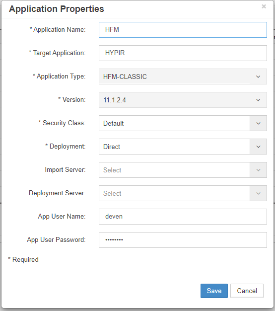

# Configuration

This section covers the initial configuration steps for setting up your EPMware application, including adding target application servers and creating your first application.

## Add Target Application Server

The first step in configuring EPMware is to add your target application server. This establishes the connection between EPMware and your EPM systems.

### Steps to Add Server

1. Navigate to **Configuration** → **Infrastructure** → **Servers**
2. Click the **Add Server** button
3. Enter the server configuration details

*Server configuration dialog*

### Server Configuration Fields

| Field | Description | Required |
|-------|-------------|----------|
| **Server Name** | Unique identifier for the server | Yes |
| **Server Type** | Type of EPM application (e.g., Planning, Essbase) | Yes |
| **Server URL** | Full URL including protocol and port | Yes |
| **Username** | Administrative user for the target system | Yes |
| **Password** | Password for the administrative user | Yes |
| **Identity Key** | Indentity Key | No |

!!! note "Username Case Sensitivity"
    The username field is case-sensitive. Ensure you enter it exactly as configured in your target system.

### Test Connection

After entering the server details:

1. Click **Test Connection** to verify connectivity
2. Review any error messages
3. Save the configuration once the test is successful

## Create EPMware Application

After adding the target server, create your EPMware application.

### Application Creation Steps

1. Navigate to **Configuration** → **Application** → **Configure**
2. Click the **Add Application** button 
3. Input the application properties
4. Click **Save**
5.	Select the Properties Tab and select the new Application from the drop down
6.	Update the Properties as required
7.	Select the Configuration Tab and click Import  
8.	Choose Manual Import or Auto Import

*Application creation dialog*

### Import Progress

During import:

- Progress bar shows completion status
- Log displays current operations
- Errors are highlighted in red
- Warnings appear in yellow

!!! tip "Import Best Practices"
    - Review import logs for any warnings
    - Verify imported data before proceeding

## Troubleshooting

### Common Configuration Issues

**Server Connection Fails**

- Verify network connectivity
- Check firewall rules
- Confirm server URL format
- Validate credentials

**Application Creation Errors**

- Ensure unique application name
- Check for special characters
- Verify server selection
- Review error logs

**Import Failures**

- Check source system availability
- Verify user permissions

## Next Steps

After completing the configuration:

1. Proceed to [Security](../security/) to update admin credentials
2. Configure [Global Settings](../global-settings/)
3. Start required [Services](../services/)

---

## Related Topics

- [Security Configuration](../security/)
- [Global Settings](../global-settings/)
- [Workflow Setup](../workflow/)
- [Reference Guide](../reference/)
