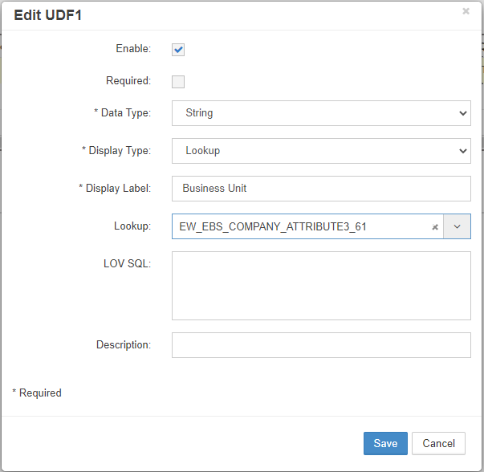

# Global Settings

Global Settings configure system-wide parameters that affect all users and applications in EPMware. These settings include email configuration, application URLs, and user-defined fields.

## Accessing Global Settings

To access Global Settings:

1. Navigate to **Misc** → **Global**
2. The Global Settings page displays with multiple configuration tabs

.

*Global Settings configuration interface*

## Email Settings

Email settings control how EPMware sends notifications, alerts, and system messages to users.

### Configuration Fields

| Setting | Description | Required | Example |
|---------|-------------|----------|---------|
| **Append Fixed value for Email Subject (Prefix)** | Prefix to distinguish environment in email subjects | No | TEST, PROD, DEV |
| **From Email Address** | Sender address for all system emails | Yes | admin@epmware.com |
| **Override Email Address** | Redirect all emails to this address (for testing) | No | test@epmware.com |

### Override Email Address

The Override Email Address is useful for:
- Testing email functionality
- Training environments
- Development systems
- Preventing emails to end users during testing

## Application Settings

Application settings define core system parameters and URLs.

### Configuration Options

| Setting | Description | Required | Example |
|---------|-------------|----------|---------|
| **EPMware Application URL** | Full URL of the EPMware application | Yes | https://demo.epmwarecloud.com |
| **Organization Name** | Your company/organization name | No | Acme Corporation |

!!! important "URL Format"
    Always include the full URL with protocol (https://) and do not include a trailing slash.

## User Defined Fields (UDF)

User Defined Fields allow customization of EPMware to capture organization-specific information.

*User Defined Fields configuration*

## Next Steps

After configuring Global Settings:

1. [Start required services](../services/)
2. [Create workflows](../workflow/)
3. [Set up deployments](../deployment/)
4. Test end-to-end process flow

---

## Related Topics

- [Email Troubleshooting](../reference/#email-troubleshooting)
- [Services Configuration](../services/)
- [Security Settings](../security/)
- [System Administration](../reference/)
