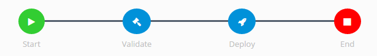

# Workflow

Workflows in EPMware define the approval process for metadata changes. A workflow consists of stages containing tasks that must be completed in sequence.

*Workflow Builder*

## Understanding Workflows

A **Workflow** is comprised of:

- **Stages**: Sequential steps in the approval process
- **Tasks**: Actions assigned to stages (review, approve, validate)
- **Approvers and Reviewers**: Users or groups responsible for tasks

## Create Workflow Tasks

Before creating a workflow, define the tasks that will be used in workflow stages.

### Steps to Create Tasks

1. Navigate to **Workflow** → **Tasks**
2. Click the **Add** button 
3. Configure task properties
4. Save the task

## Create Workflow

After defining tasks, create the workflow structure.

### Workflow Creation Steps

1. Navigate to **Workflow** → **Builder**
2. Click the **Add** button  to create a new workflow

## Add Stages

Stages define the sequential steps in your workflow.

### Creating Stages

1. With your workflow selected, click the **Stage Menu** button 
2. Select **Add Stage**
3. Configure stage properties:

| Property | Description | Example |
|----------|-------------|---------|
| **Stage #** | Sequence order (defines flow) | 1, 2, 3... |
| **Stage Name** | Descriptive stage name | Initial Review |
| **Required Approvals** | Number needed to proceed | All, Any, Specific # |

## Assign Tasks to Stages

Add tasks to stages to define what actions occur at each step.

### Task Assignment Process

1. Select a stage in the workflow designer
2. Click **Add Task to Stage**
3. Choose from available tasks

| Setting | Description | Options |
|---------|-------------|---------|
| **Task** | Select predefined task | Dropdown list |

## Next Steps

After creating workflows:
1. [Set up deployment configuration](../deployment/)

---

## Related Topics

- [Deployment Configuration](../deployment/)
- [User Roles and Permissions](../security/)
- [Email Notifications](../global-settings/#email-settings)
